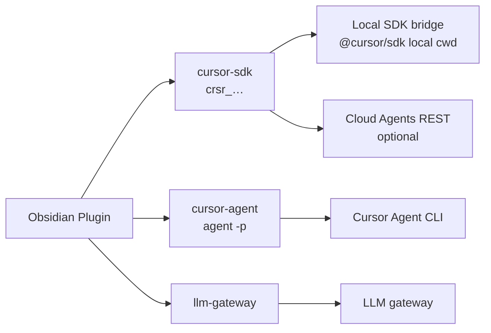

# Backend model (v0.5+)

[← Documentation index](../index.md) · [Backend selection](backend-selection.md)

The plugin exposes **three backends**, aligned with how users actually choose AI — not wire protocols.

## The three backends

| ID | User label | Credential | What runs |
|----|------------|------------|-----------|
| **`cursor-sdk`** | Cursor agent (API key) | `crsr_…` | **Local (default):** `@cursor/sdk` via Node bridge · **Cloud:** Cloud Agents REST API |
| **`cursor-agent`** | Cursor Agent (CLI) | `crsr_…` and/or machine login | `agent -p` with `CURSOR_API_KEY` in vault `cwd` |
| **`llm-gateway`** | Other models | OpenRouter / LiteLLM / OpenAI keys | OpenAI-compatible `/chat/completions` |

## Cursor SDK: local vs cloud

Per [Cursor TypeScript SDK — Usage and billing](https://cursor.com/docs/sdk/typescript#usage-and-billing):

| Runtime | What it does | Plugin path |
|---------|--------------|-------------|
| **Local** | Agent loop inline in Node; files from disk (`local.cwd`) | Default — `bridge/sdk-server.mjs` + `sdkRuntime: local` |
| **Cloud** | Agent in Cursor-hosted VM via REST | `sdkRuntime: cloud` — `POST /v1/agents` |

Same `crsr_…` key for both. **Local does not require Cloud Agents usage-based pricing headroom** — it uses standard SDK token billing like the IDE/CLI.

> **Local means local agent loop, not local model.** Inference still goes through Cursor's hosted models.

### Why not bundle `@cursor/sdk` in the plugin?

Obsidian plugins run in a browser-like renderer (no Node 22 native binaries). Local SDK runs in the **bridge** sidecar or via **CLI**.

## Cursor Agent CLI

Headless `agent -p` uses `--yolo --trust` by default. Auth via `CURSOR_API_KEY` or `agent login`.

## Setup command

**Command palette → Cursor Chat: Set up Cursor Chat**

## Migration

- `cursor-rest` → `cursor-sdk`
- `cursor-sdk-local` → `cursor-agent` (bridge is now part of `cursor-sdk` local runtime)
- `openai-compatible` → `llm-gateway`
