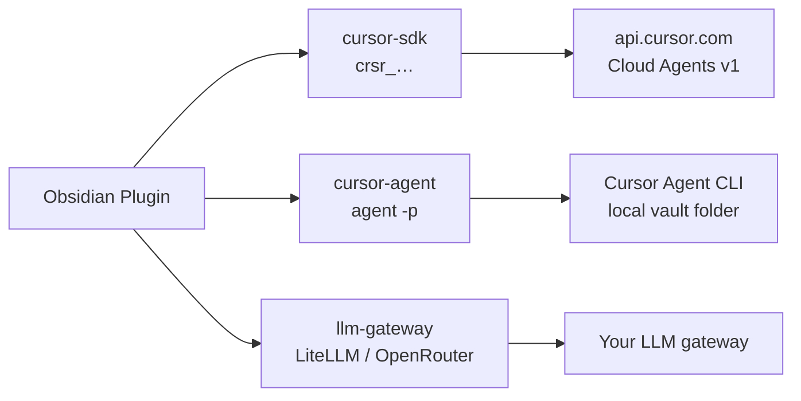

# Backend model (v0.5+)

[← Documentation index](../index.md) · [Backend selection](backend-selection.md)

The plugin exposes **three backends**, aligned with how users actually choose AI — not wire protocols.

## The three backends

| ID | User label | Credential | What runs |
|----|------------|------------|-----------|
| **`cursor-sdk`** | Cursor (SDK / API key) | `crsr_…` in plugin settings | Cursor Cloud Agents API — same platform as `@cursor/sdk` cloud runs |
| **`cursor-agent`** | Cursor Agent (CLI) | Machine login (`agent login`) — **no plugin API key** | `agent -p` subprocess with vault as `cwd` |
| **`llm-gateway`** | Other models | OpenRouter / LiteLLM / OpenAI keys | OpenAI-compatible `/chat/completions` |

## Why we dropped `cursor-rest` and `cursor-sdk-local`

Those names described **implementation** (REST vs sidecar), not **user intent**.

| Old ID | Problem | New home |
|--------|---------|----------|
| `cursor-rest` | Sounded like “not SDK”; actually *is* the Cursor agent platform | **`cursor-sdk`** — cloud path via Cloud Agents API (what the SDK uses for cloud) |
| `cursor-sdk-local` | Stub HTTP bridge; confused with SDK *and* with CLI | **`cursor-agent`** — real local path via `agent` CLI |
| `openai-compatible` | Protocol name, not product name | **`llm-gateway`** |

The Obsidian renderer **cannot** bundle `@cursor/sdk` (Node-only). For **`cursor-sdk`**, the plugin calls the **same Cloud Agents REST API** the SDK uses for cloud agents. That is intentional — not a separate product surface.

For **local file tools** without pasting notes into prompts, use **`cursor-agent`** (CLI), not a custom bridge — unless you later run a full SDK sidecar for advanced hooks/MCP.

## Cursor Agent CLI and API keys

Headless `agent -p` typically needs either:

- `agent login` on the machine (uses Cursor subscription session), **or**
- `CURSOR_API_KEY` in the environment

The plugin **does not** store a key for `cursor-agent` — it relies on CLI auth. This matches “I already use Cursor on this laptop.”

## Setup command

**Command palette → Cursor Chat: Set up Cursor Chat**

Walks through backend choice, credentials, and connection test. Opens automatically on first chat open until `hasCompletedSetup` is true.

## Migration

Persisted `backend` values from v0.4 are migrated on load:

- `cursor-rest` → `cursor-sdk`
- `cursor-sdk-local` → `cursor-agent`
- `openai-compatible` → `llm-gateway`

## Future: optional SDK sidecar

The `bridge/` package remains for a possible **local `@cursor/sdk` sidecar** (hooks, MCP, `local.cwd`). It is **not** a fourth user-facing backend today — overlap with `cursor-agent` is too high for v0.5.
