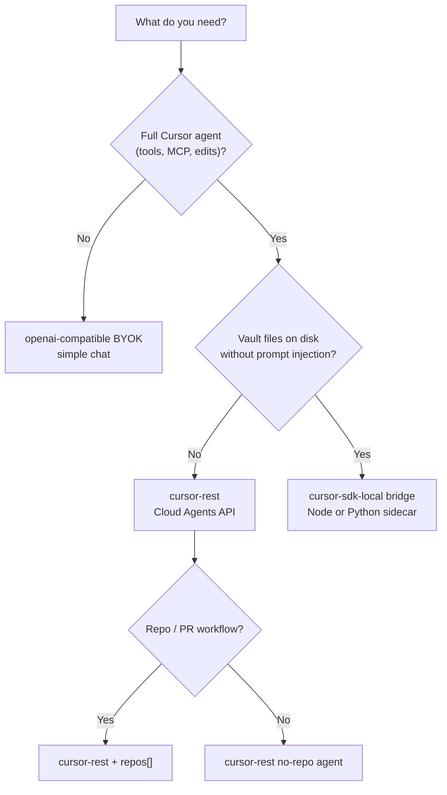
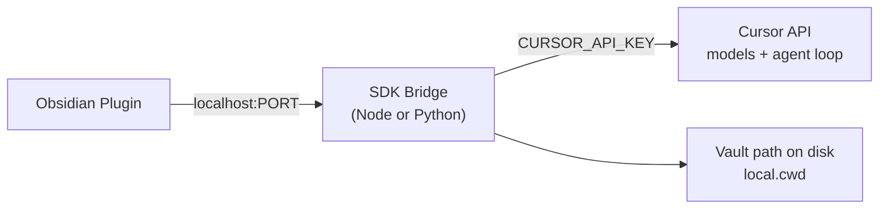

# Backend selection — BYOK, SDK, or REST?

[← Documentation index](../index.md)

The plugin supports **multiple connection backends**. Pick based on what you need — not everything requires the Cursor SDK or even a Cursor API key.

> Related: [BYOK](../backends/byok.md) · [Cursor REST](../backends/cursor-rest.md) · [SDK bridge](../backends/sdk-bridge.md) · [Architecture design](../architecture/design.md)

## Three credential models (do not confuse them)

| Model | Key type | Where inference runs | Agent tools / MCP |
|-------|----------|----------------------|-------------------|
| **A. Cursor API key** | `crsr_…` from [Dashboard → API Keys](https://cursor.com/dashboard) | Cursor-hosted models + agent loop | Yes (cloud or local via SDK) |
| **B. LLM BYOK** | User's OpenAI / Anthropic / Scaleway / etc. key + optional base URL | Provider directly | No (plain chat completion only) |
| **C. OpenAI-compatible proxy** | Any key your proxy accepts | Your proxy | Depends on proxy |

**"BYOK" in this project means B (and optionally C)** — the user supplies their own provider credentials for simple chat.

**Cursor API key (A)** is separate: it authenticates to Cursor's agent platform (SDK + Cloud Agents API). It is still "your key", but it bills through Cursor and uses Cursor's agent stack — not a raw OpenAI passthrough.

> Cursor IDE's own BYOK (Settings → API Keys → override OpenAI base URL) is a third product surface. Agent/Edit modes with BYOK require a paid Cursor subscription. This plugin does **not** replicate that IDE settings panel; it either talks to providers directly (B) or to Cursor's API (A).

---

## Decision matrix

| Your need | Recommended backend | Credential |
|-----------|---------------------|------------|
| Chat about notes, minimal deps, user has OpenAI key | `openai-compatible` | Provider BYOK |
| Chat about notes, user has Cursor subscription + API key | `cursor-rest` | `crsr_…` |
| Full Cursor agent: tools, MCP, plan/agent modes, cloud VM | `cursor-rest` or `cursor-sdk-cloud` | `crsr_…` |
| Agent reads/writes vault **files on disk** (real paths) | `cursor-sdk-local` (bridge) | `crsr_…` |
| Agent works on a GitHub repo linked to vault | `cursor-rest` with `repos[]` | `crsr_…` |
| Headless / scripting / multi-agent orchestration | `cursor-sdk` (external, not in-plugin) | `crsr_…` |
| No network except to user's Ollama/LM Studio | `openai-compatible` → local base URL | None or local |
| Mobile Obsidian | `openai-compatible` or poll-based `cursor-rest` | Varies |



---

## Backend implementations

### 1. `openai-compatible` (BYOK — default for note Q&A)

**Best for:** Summarize notes, ask questions, light editing suggestions — when the user already pays OpenAI/Anthropic/etc. directly.

- Plugin calls provider's chat-completions API (streaming)
- Vault context injected in system/user messages (same `VaultContextBuilder`)
- No Cursor account required
- No agent tools, no MCP, no `bc-*` agents

Settings:

| Field | Example |
|-------|---------|
| `provider` | `openai` \| `anthropic` \| `openai-compatible` |
| `apiKey` | `sk-…` |
| `baseUrl` | `https://api.openai.com/v1` or `https://api.scaleway.ai/v1` |
| `model` | `gpt-4o`, `claude-sonnet-4-…`, etc. |

See [BYOK](../backends/byok.md).

### 2. `cursor-rest` (Cursor API key — no sidecar)

**Best for:** Cursor-native models and cloud agents without installing anything beyond Obsidian.

- Direct HTTPS to `api.cursor.com` (Cloud Agents API v1)
- SSE streaming from plugin via `fetch` + `eventsource-parser`
- `@cursor/sdk` **not** bundled in plugin
- Vault context still injected into `prompt.text` (Cursor has no vault mount)

See [Cursor REST](../backends/cursor-rest.md).

### 3. `cursor-sdk-local` (bridge — TypeScript or Python)

**Best for:** Local agent loop against the vault directory on disk — real `read_file` / `write` / `grep` on notes without pasting content into prompts.

Obsidian plugin ↔ **localhost HTTP** ↔ bridge process running `cursor-sdk`:

| Bridge | Package | Runtime | Notes |
|--------|---------|---------|-------|
| TypeScript | `@cursor/sdk` | Node ≥ 22.13 | `CursorClient.launch_bridge()` or `connect()` |
| Python | `cursor-sdk` | Python ≥ 3.10 | `CursorClient.launch_bridge()` or `connect()` |



Bridge exposes a thin local API (plugin-owned contract):

```
POST /agents          → Agent.create({ local: { cwd: vaultPath } })
POST /agents/:id/send → agent.send(message) → { runId }
GET  /runs/:id/stream → SSE (proxy run.stream() / run.messages())
POST /runs/:id/cancel → run.cancel()
```

User still provides **`crsr_…`** to the bridge (env or settings). The plugin never embeds the SDK.

See [SDK bridge](../backends/sdk-bridge.md).

### 4. `cursor-sdk-cloud` (bridge optional)

Cloud agents via SDK from a bridge process — useful when you want SDK ergonomics (`Agent.resume`, `run.conversation()`) without reimplementing REST.

For most users, **`cursor-rest` is enough** for cloud; bridge adds value mainly for **local** agents.

---

## Recommended default per use case

| Persona | Default backend | Why |
|---------|-----------------|-----|
| Note-taker, already has OpenAI | `openai-compatible` | Cheapest path, true BYOK |
| Cursor subscriber, wants same models as IDE | `cursor-rest` | No sidecar, agent features in cloud |
| Power user, vault-as-codebase | `cursor-sdk-local` | Agent edits files directly |
| Team automation | External `cursor-sdk` script | Out of plugin scope |

---

## Plugin settings: backend picker

```typescript
type ChatBackend =
  | "openai-compatible"   // BYOK
  | "cursor-rest"         // crsr_ key, Cloud Agents API
  | "cursor-sdk-local";   // crsr_ key + bridge URL

interface PluginSettings {
  backend: ChatBackend;
  // BYOK block
  byok?: { provider: string; apiKey: string; baseUrl: string; model: string };
  // Cursor block
  cursor?: { apiKey: string; defaultModelId?: string; bridgeUrl?: string };
}
```

Only show relevant fields per backend. **Never send BYOK keys to Cursor** or `crsr_` keys to OpenAI.

---

## What we are NOT building

| Item | Reason |
|------|--------|
| Bundling `@cursor/sdk` inside `main.js` | Node 22 + native binaries; wrong Obsidian runtime |
| Bundling `cursor-sdk` Python in plugin | Same |
| Cursor IDE settings sync | No public API for IDE-internal BYOK config |
| Tab completion | Different Cursor product surface |

---

## Phased rollout (revised)

| Phase | Backend | Deliverable |
|-------|---------|-------------|
| **1** | `openai-compatible` | BYOK chat MVP — fastest user value |
| **2** | `cursor-rest` | Cursor API key + cloud agent + SSE |
| **3** | `cursor-sdk-local` | Optional bridge package + local agent mode |
| **4** | Polish | Backend switcher, unified session UI, MCP via bridge |
