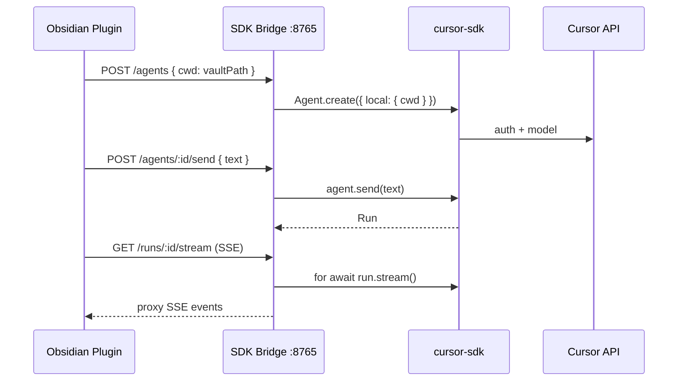

# Cursor SDK bridge (local agent mode)

[← Documentation index](../index.md) · [Backend selection](../architecture/backend-selection.md)

When **`cursor-rest` is not enough** — you need the agent to read and edit vault files on disk — run the Cursor SDK in a **sidecar process** and talk to it from the Obsidian plugin over localhost.

> Compare: [Cursor REST](../backends/cursor-rest.md) (cloud REST, no sidecar) · [BYOK](../backends/byok.md) (no Cursor at all)

Applies to both:

- [TypeScript SDK](https://cursor.com/docs/sdk/typescript) — `@cursor/sdk`, Node ≥ 22.13
- [Python SDK](https://cursor.com/docs/sdk/python) — `cursor-sdk`, Python ≥ 3.10

Same agent, same `CURSOR_API_KEY` (`crsr_…`). **Not BYOK** — this path uses Cursor's agent platform and hosted models.

---

## Why a bridge?

| Capability | In-plugin REST | SDK local bridge |
|------------|----------------|------------------|
| Run in Obsidian renderer | Yes | No — SDK needs Node/Python |
| Read vault files | Via prompt injection | Native `read_file` on `local.cwd` |
| Edit vault files | Manual apply | Agent `write` / `edit` tools |
| `.cursor/rules`, hooks, MCP from disk | No | Yes (`local.settingSources`) |
| Custom tools (Python/TS callbacks) | No | Yes (`customTools` / `custom_tools`) |
| Sandbox | N/A | `sandboxOptions.enabled` |

---

## Architecture



---

## Bridge implementation options

### Option A — TypeScript (recommended for Node shops)

```typescript
// bridge/src/server.ts (separate package: obsidian-cursor-bridge)
import { CursorClient, Agent } from "@cursor/sdk";
import express from "express";

const app = express();
app.use(express.json());

let client: CursorClient;

app.post("/agents", async (req, res) => {
  const { cwd, model, apiKey } = req.body;
  const agent = await client.agents.create({
    apiKey: apiKey ?? process.env.CURSOR_API_KEY,
    model: { id: model ?? "composer-2.5" },
    local: { cwd, settingSources: ["project", "user"] },
  });
  res.json({ agentId: agent.agentId });
});

// … send, stream, cancel, health
```

Launch:

```typescript
const client = await CursorClient.launch_bridge({ workspace: vaultPath });
// or connect to existing: CursorClient.connect({ baseUrl, authToken })
```

### Option B — Python

```python
# bridge/server.py
from cursor_sdk import CursorClient, LocalAgentOptions

with CursorClient.launch_bridge(workspace=vault_path) as client:
    with client.agents.create(
        model="composer-2.5",
        api_key=api_key,
        local=LocalAgentOptions(cwd=vault_path, setting_sources=["project", "user"]),
    ) as agent:
        run = agent.send("Summarize today's journal")
        for message in run.messages():
            ...
```

Async variant: `AsyncClient.launch_bridge()` for concurrent chats.

### Option C — Connect to existing bridge

If the user already runs `cursor-sdk-bridge` (bundled with Python package):

```bash
cursor-sdk-bridge --help
```

Plugin uses `CursorClient.connect({ baseUrl: "http://127.0.0.1:8765", authToken })` pattern — expose the same in bridge HTTP API.

---

## Plugin ↔ bridge contract (minimal REST)

| Endpoint | Maps to SDK |
|----------|-------------|
| `GET /health` | Bridge alive, SDK version |
| `POST /agents` | `Agent.create({ local: { cwd } })` |
| `POST /agents/:id/send` | `agent.send(message)` → `{ runId }` |
| `GET /agents/:id/runs/:runId/stream` | `run.stream()` / `run.messages()` as SSE |
| `POST /agents/:id/runs/:runId/cancel` | `run.cancel()` |
| `GET /agents/:id` | `Agent.get()` / resume metadata |
| `DELETE /agents/:id` | `agent.close()` |

Auth between plugin and bridge:

- `Authorization: Bearer <bridge-token>` (generated on bridge start, stored in plugin settings)
- `CURSOR_API_KEY` stays **on the bridge host** (env var preferred over plugin forwarding)

---

## Vault path resolution

```typescript
// Obsidian adapter path → filesystem path
const vaultPath = (app.vault.adapter as FileSystemAdapter).getBasePath();
```

Pass to bridge on every `create`. Vault must be **local folder** (not purely remote/iCloud without local sync).

---

## Stream event mapping

Bridge normalizes SDK messages to the same `StreamEvent` union as `cursor-rest` where possible:

| SDK `type` | Plugin event |
|------------|--------------|
| `assistant` | `assistant` text deltas |
| `thinking` | `thinking` (optional UI) |
| `tool_call` | `tool_call` card |
| `usage` | token badge |
| terminal `run.wait()` | `result` |

Use `onDelta` / `on_delta` in SDK only if bridge needs finer token granularity.

---

## Operational concerns

| Topic | Guidance |
|-------|----------|
| **Install** | Ship bridge as optional `npm`/`uv` package; plugin settings → "Start bridge" spawns child process (desktop only) |
| **Updates** | Pin `@cursor/sdk` / `cursor-sdk` version in bridge; plugin checks `/health` version |
| **Security** | Bind bridge to `127.0.0.1` only; random bridge token; never expose on LAN |
| **Lifecycle** | Kill bridge when Obsidian exits; `agent.close()` on thread delete |
| **Headless approval** | Local SDK auto-approves tool calls — use `sandboxOptions.enabled` or hooks in `.cursor/hooks.json` |

---

## Cloud agents via SDK (optional)

Bridge can also run cloud agents:

```typescript
await client.agents.create({
  apiKey,
  model: { id: "composer-2.5" },
  cloud: {
    repos: [{ url: "https://github.com/org/vault-repo", startingRef: "main" }],
  },
});
```

Usually redundant if plugin already has `cursor-rest`. Prefer REST for cloud unless you need `run.conversation()` shape without reimplementing parsers.

---

## When to skip the bridge

- User only wants **chat about notes** → `openai-compatible` BYOK or `cursor-rest` no-repo
- User won't install Node 22+ or Python 3.10+
- Vault is not a local folder
- Mobile-only workflow
