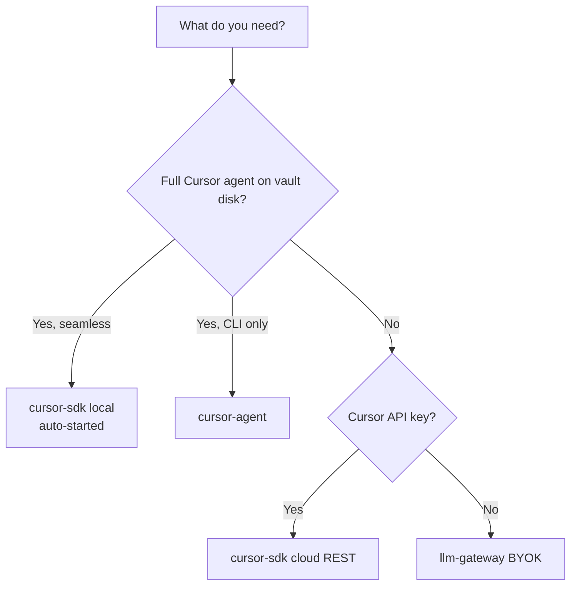

# Cursor Chat for Obsidian

AI chat sidebar for Obsidian with **three pluggable backends**: Cursor SDK (local or cloud), Cursor Agent CLI, or an LLM gateway (OpenRouter / LiteLLM / BYOK).

## Quick links

| I want to… | Start here |
|------------|------------|
| Install and try the plugin | [Installation](getting-started/installation.md) |
| Develop locally | [Local development](getting-started/local-development.md) |
| Pick a backend | [Backend model](architecture/backend-model.md) |
| Read the architecture | [System design](architecture/design.md) |
| Track implementation PRs | [Roadmap](development/roadmap.md) |

## Three backends (v0.5+)

| Backend | Credential | Documentation |
|---------|------------|---------------|
| `cursor-sdk` | Cursor API key (`crsr_…`) | [Cursor SDK](backends/cursor-sdk.md) |
| `cursor-agent` | `crsr_…` and/or `agent login` | [Cursor Agent CLI](backends/cursor-agent.md) |
| `llm-gateway` | Provider API key | [LLM Gateway (BYOK)](backends/byok.md) |

## Project status

| Version | Highlights |
|---------|------------|
| **v0.5.0** (current) | Three-backend model, setup wizard, local SDK auto-start |
| v0.4.0 | SDK bridge package |
| v0.3.0 | Multi-session UX |
| v0.2.0 | Cursor REST / SSE |
| v0.1.0 | BYOK MVP |

See the [implementation roadmap](development/roadmap.md) and [changelog](reference/changelog.md).

## License

[MIT](https://github.com/guilyx/obsidian-cursor-plugin/blob/main/LICENSE) — Copyright (c) 2026 Erwin Lejeune

## Repository

- [GitHub — obsidian-cursor-plugin](https://github.com/guilyx/obsidian-cursor-plugin)
- [Cursor Cloud Agents API](https://cursor.com/docs/cloud-agent/api/endpoints)
- [Obsidian plugin developer docs](https://docs.obsidian.md/Plugins/Getting+started/Build+a+plugin)
