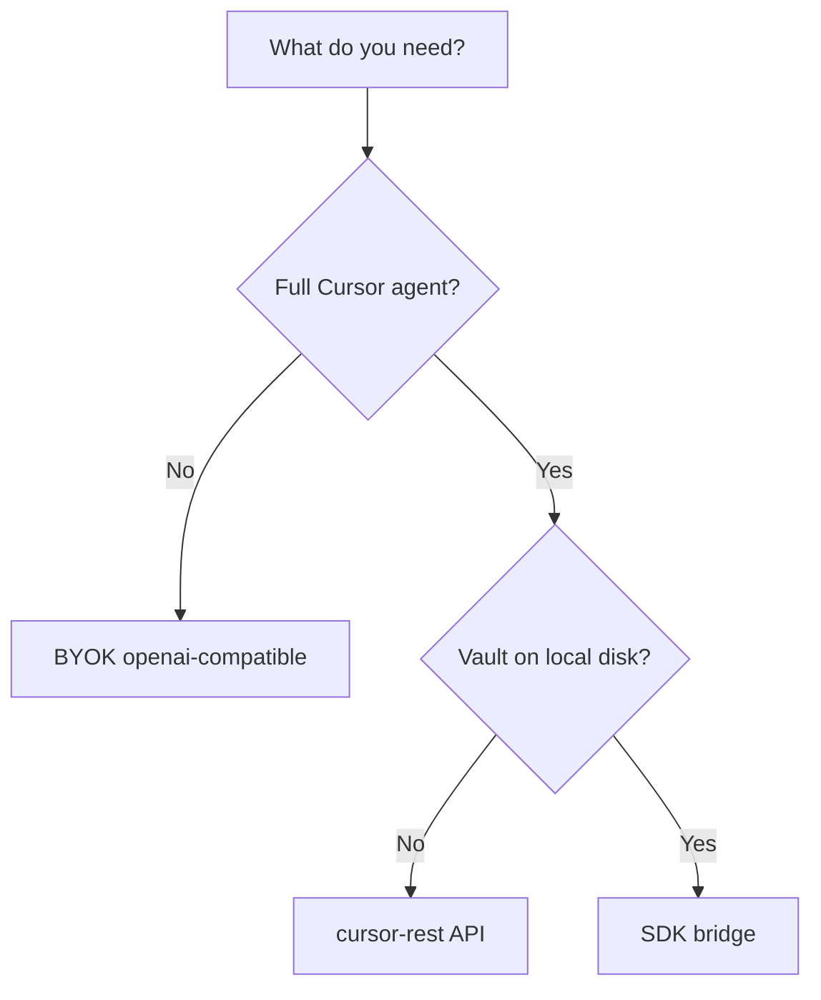

# Cursor Chat for Obsidian

AI chat sidebar for Obsidian with **pluggable backends**: bring your own LLM key (BYOK), Cursor Cloud Agents (REST), or a local Cursor SDK bridge.

## Quick links

| I want to… | Start here |
|------------|------------|
| Install and try the plugin | [Installation](getting-started/installation.md) |
| Develop locally | [Local development](getting-started/local-development.md) |
| Pick a backend | [Backend selection](architecture/backend-selection.md) |
| Read the architecture | [System design](architecture/design.md) |
| Track implementation PRs | [Roadmap](development/roadmap.md) |

## Three backends

| Backend | Credential | Documentation |
|---------|------------|---------------|
| `openai-compatible` | Provider BYOK (`sk-…`) | [BYOK](backends/byok.md) |
| `cursor-rest` | Cursor API key (`crsr_…`) | [Cursor REST](backends/cursor-rest.md) |
| `cursor-sdk-local` | `crsr_…` on bridge host | [SDK bridge](backends/sdk-bridge.md) |

## Project status

| Area | Status |
|------|--------|
| **v0.1.0** | BYOK MVP — scaffold + sidebar chat (PR #1) |
| **cursor-rest** | Planned (PR #2) |
| **Multi-session UX** | Planned (PR #3) |
| **SDK bridge** | Planned (PR #4) |

See the [implementation roadmap](development/roadmap.md) and [changelog](reference/changelog.md).

## Repository

- [GitHub — obsidian-cursor-plugin](https://github.com/guilyx/obsidian-cursor-plugin)
- [Cursor Cloud Agents API](https://cursor.com/docs/cloud-agent/api/endpoints)
- [Obsidian plugin developer docs](https://docs.obsidian.md/Plugins/Getting+started/Build+a+plugin)
