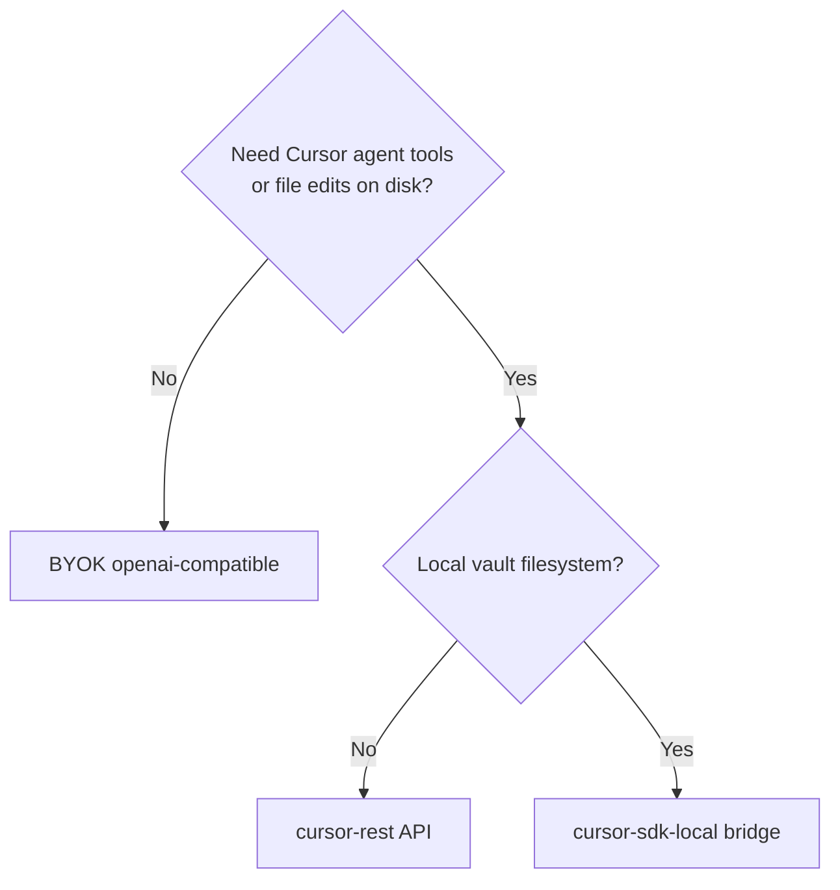

# obsidian-cursor-plugin

Obsidian plugin that embeds an **AI chat sidebar** with **pluggable backends**:

| Backend | Credential | Use case |
|---------|------------|----------|
| **BYOK** (`openai-compatible`) | Your OpenAI / Anthropic / Ollama key | Simple chat about notes — no Cursor required |
| **Cursor REST** (`cursor-rest`) | Cursor API key (`crsr_…`) | Cloud agents via [Cloud Agents API](https://cursor.com/docs/cloud-agent/api/endpoints) |
| **SDK bridge** (`cursor-sdk-local`) | `crsr_…` on sidecar | Full local agent on vault disk via [@cursor/sdk](https://cursor.com/docs/sdk/typescript) or [Python SDK](https://cursor.com/docs/sdk/python) |

## Status

**Design phase** — docs in place; implementation not started.

## Pick your path

Read **[docs/BACKEND-SELECTION.md](./docs/BACKEND-SELECTION.md)** first.



## Documentation

| Doc | Description |
|-----|-------------|
| [docs/BACKEND-SELECTION.md](./docs/BACKEND-SELECTION.md) | **Start here** — decision matrix |
| [docs/BYOK.md](./docs/BYOK.md) | Provider-direct BYOK |
| [docs/API-INTEGRATION.md](./docs/API-INTEGRATION.md) | Cursor REST / Cloud Agents API |
| [docs/SDK-BRIDGE.md](./docs/SDK-BRIDGE.md) | TypeScript / Python SDK sidecar |
| [docs/DESIGN.md](./docs/DESIGN.md) | Full architecture |
| [docs/DEVELOPMENT.md](./docs/DEVELOPMENT.md) | Build guide |
| [docs/UX.md](./docs/UX.md) | UI spec |

## Architecture

```
Obsidian Chat View → BackendRouter → BYOK | cursor-rest | cursor-sdk-bridge
                          ↓
                   VaultContextBuilder
```

- **BYOK**: vault context in prompts → provider API
- **cursor-rest**: vault context in `prompt.text` → `api.cursor.com`
- **SDK bridge**: agent `local.cwd` = vault path on disk

## Prerequisites

Depends on backend — see [BACKEND-SELECTION.md](./docs/BACKEND-SELECTION.md).

## License

TBD
