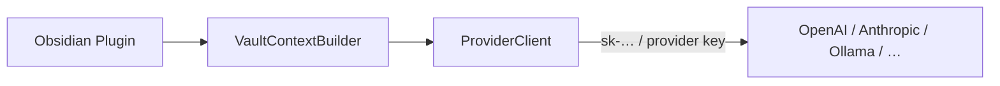

# BYOK — Bring Your Own Key (provider-direct)

Default path for users who want **simple AI chat** in Obsidian without a Cursor API key or agent infrastructure.

## Overview

The plugin calls an **OpenAI-compatible** or native provider API directly. The user's key never passes through Cursor.



## Supported provider shapes

| Provider | API style | Streaming | Notes |
|----------|-----------|-----------|-------|
| OpenAI | `/v1/chat/completions` | SSE `data: …` | Reference implementation |
| Anthropic | Messages API | SSE | Separate client, not OpenAI-shaped |
| OpenAI-compatible | Custom `baseUrl` | Usually SSE | Ollama, LM Studio, Scaleway, Groq, etc. |
| Azure OpenAI | OpenAI + deployment path | SSE | `baseUrl` + deployment name |

Start with **OpenAI-compatible** only; add Anthropic as a second adapter when needed (ponytail: one interface, two implementations max in v1).

## Settings

| Field | Required | Description |
|-------|----------|-------------|
| `apiKey` | Yes (except local Ollama) | Provider secret |
| `baseUrl` | For compatible providers | e.g. `https://api.openai.com/v1` |
| `model` | Yes | `gpt-4o`, `qwen3.5-…`, etc. |
| `maxTokens` | No | Cap completion length |
| `temperature` | No | Default 0.7 |

Store in Obsidian plugin data (password input in settings). Document that keys are plaintext in `data.json` unless the user uses OS-level vault encryption.

## Request shape (OpenAI-compatible)

```typescript
interface ChatCompletionRequest {
  model: string;
  messages: Array<{ role: "system" | "user" | "assistant"; content: string }>;
  stream: true;
}
```

### System prompt (vault-aware)

```text
You are an assistant embedded in the user's Obsidian vault.
Answer using the provided note context. Prefer concise, markdown-friendly replies.
When referencing notes, use [[wikilink]] syntax if the path is known.
```

User message = `VaultContextBuilder.build()` + composer text.

## Streaming in Obsidian

```typescript
const res = await fetch(`${baseUrl}/chat/completions`, {
  method: "POST",
  headers: {
    Authorization: `Bearer ${apiKey}`,
    "Content-Type": "application/json",
  },
  body: JSON.stringify({ model, messages, stream: true }),
});

// Parse SSE with eventsource-parser (same lib as cursor-rest)
```

Desktop: native `fetch` usually works. If CORS blocks a local Ollama URL from mobile, show a clear error — mobile BYOK to LAN is a known Obsidian limitation.

## Session model (local only)

Unlike Cursor agents, BYOK mode has **no `bc-*` id**. Sessions are entirely local:

```typescript
interface ByokSession {
  id: string;
  title: string;
  messages: StoredMessage[];  // full history resent each request (or windowed)
  model: string;
}
```

Optional: summarize old turns to stay within context limits (Phase 2).

## Limitations vs Cursor backends

| Feature | BYOK | `cursor-rest` / SDK |
|---------|------|---------------------|
| Tool use / agent loop | No | Yes |
| MCP servers | No | Yes |
| Plan / Agent modes | No | Yes |
| Edit files on disk | No (suggestions only) | Yes (SDK local) |
| Cursor billing / models | No | Yes |
| Works without Cursor account | Yes | No |

## Test connection

```http
GET {baseUrl}/models
Authorization: Bearer {apiKey}
```

Or minimal completion with `max_tokens: 1`.

## Security

- Keys stay in plugin settings; never in note frontmatter
- Do not log request bodies containing vault content in production
- Warn on first use: note text is sent to the **chosen provider**, not Cursor
