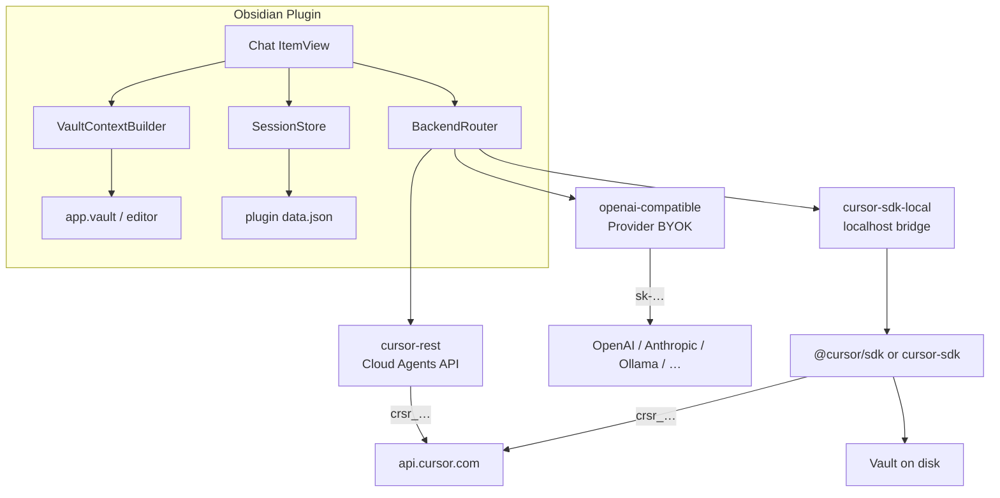
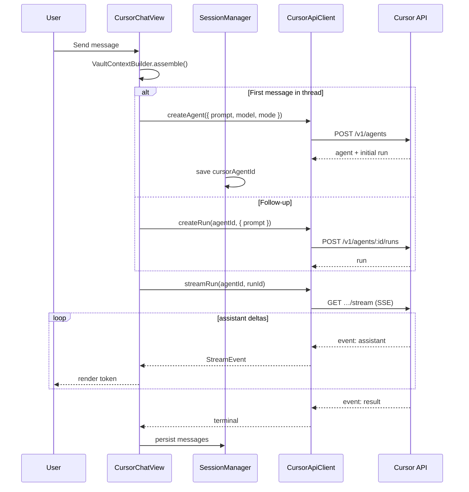

# Design — obsidian-cursor-plugin

[[Home|← Documentation index]]

## 1. Problem statement

Obsidian users want Cursor-grade AI assistance **inside their note-taking workflow** without leaving the vault. Cursor already exposes programmatic access through the **Cloud Agents API** and **TypeScript SDK**, but neither is an Obsidian plugin today.

This plugin bridges that gap: a native Obsidian sidebar chat with **pluggable backends** — BYOK to any LLM provider, Cursor Cloud Agents over REST, or full local agents via an optional **SDK bridge** (TypeScript or Python).

> **Start here:** [[BACKEND-SELECTION]] — pick the right path for your needs.

## 2. Goals

| Goal | Description |
|------|-------------|
| **In-vault chat** | Persistent sidebar `ItemView` with multi-turn conversations |
| **BYOK first** | Provider-direct chat (OpenAI-compatible) without requiring Cursor |
| **Cursor integration** | Optional `crsr_…` key → Cloud Agents API or SDK local bridge |
| **Streaming UX** | Token-by-token output, tool-call visibility (Cursor backends), cancel |
| **Vault awareness** | Active file, selection, `@note` mentions; or disk access via SDK bridge |
| **Secure credentials** | Keys stored locally per backend; never logged or cross-sent |
| **Resumable sessions** | Conversations survive Obsidian restarts |

## 3. Non-goals (v1)

- Mirroring the full Cursor IDE UI (composer tabs, inline diffs, Tab completion)
- Bundling `@cursor/sdk` or `cursor-sdk` **inside** the Obsidian plugin bundle
- Syncing Cursor IDE internal BYOK settings (no public API)
- Mobile-first parity for SDK bridge or SSE (desktop first)
- Replacing Obsidian Sync or git-based vault sync

## 4. Architectural overview



### 4.1 Backend choice (summary)

| Backend | Credential | See |
|---------|------------|-----|
| `openai-compatible` | Provider BYOK (`sk-…`) | [[BYOK]] |
| `cursor-rest` | Cursor API key (`crsr_…`) | [[API-INTEGRATION]] |
| `cursor-sdk-local` | `crsr_…` on bridge host | [[SDK-BRIDGE]] |

Full decision matrix: [[BACKEND-SELECTION]].

### 4.2 Runtime choice: three layers, not one

| Layer | Runs where | Verdict |
|-------|------------|---------|
| BYOK provider client | Obsidian renderer | **Default MVP** — simple chat, true bring-your-own-key |
| Cloud Agents REST + SSE | Obsidian renderer | **Cursor without sidecar** — agent features in cloud |
| `@cursor/sdk` / `cursor-sdk` | Optional bridge process | **Local agent on vault disk** — Node ≥ 22 or Python ≥ 3.10 |

SDK is **not rejected** — it runs in a **sidecar**, not inside `main.js`.

### 4.2 Agent model mapping

Cursor v1 API separates **durable agents** from **per-prompt runs**:

| Cursor concept | Plugin mapping |
|----------------|----------------|
| `Agent` (`bc-…`) | One Obsidian **chat thread** |
| `Run` (`run-…`) | One **user message → assistant reply** cycle |
| `prompt.text` | User message + assembled vault context |
| SSE `assistant` events | Streaming tokens in the UI |
| `GET …/runs/:id` | Fallback when stream expires (`410`) |

**No-repo agents** (omit `repos` and `env` on create) are the default for vault Q&A. Optional **repo-linked mode** attaches a GitHub repo when the vault is git-backed and the user wants code-agent behaviour.

### 4.3 Conversation modes

| Mode | Cursor `mode` | Use in Obsidian |
|------|---------------|-----------------|
| **Ask** | `plan` | Explore ideas, summarize notes, no file edits expected |
| **Agent** | `agent` | Multi-step reasoning; may suggest note edits (applied manually in v1) |

Mode is set on agent create and can be overridden per follow-up run.

## 5. Component design

### 5.1 `CursorChatPlugin` (main.ts)

Responsibilities:

- Register `CURSOR_CHAT_VIEW` `ItemView`
- Load / save settings and session index
- Register commands: *Open Cursor Chat*, *New chat*, *Send selection to chat*
- Ribbon icon
- Wire `CursorApiClient` with settings

### 5.2 `CursorChatView` (views/CursorChatView.ts)

Extends `ItemView`. Hosts the chat DOM (vanilla TypeScript for v1 — no React unless UI complexity forces it).

Sub-regions:

| Region | Responsibility |
|--------|----------------|
| Header | Thread title, model picker, mode toggle, new-chat |
| MessageList | Scrollable history with markdown rendering |
| Composer | Textarea, send/stop, context chips |
| StatusBar | Connection state, token usage, agent link |

### 5.3 `BackendRouter` (backends/BackendRouter.ts)

Selects implementation from `settings.backend`:

```typescript
interface ChatBackend {
  send(session: ChatSession, message: string, context: VaultContext): AsyncGenerator<StreamEvent>;
  validateSettings(): Promise<void>;
  listModels?(): Promise<Model[]>;
}

class BackendRouter {
  constructor(settings: PluginSettings) {
    switch (settings.backend) {
      case "openai-compatible": return new ByokBackend(settings.byok);
      case "cursor-rest": return new CursorRestBackend(settings.cursor);
      case "cursor-sdk-local": return new CursorBridgeBackend(settings.cursor);
    }
  }
}
```

### 5.4 `ByokBackend` (backends/ByokBackend.ts)

OpenAI-compatible chat completions. See [[BYOK]].

### 5.5 `CursorApiClient` (api/CursorApiClient.ts)

Thin typed wrapper over Cloud Agents API (`cursor-rest`):

```typescript
interface CursorApiClient {
  validateKey(): Promise<MeResponse>;
  listModels(): Promise<Model[]>;
  createAgent(opts: CreateAgentRequest): Promise<{ agent: Agent; run: Run }>;
  createRun(agentId: string, opts: CreateRunRequest): Promise<Run>;
  streamRun(agentId: string, runId: string, opts?: StreamOptions): AsyncGenerator<StreamEvent>;
  getRun(agentId: string, runId: string): Promise<RunDetail>;
  cancelRun(agentId: string, runId: string): Promise<void>;
  listAgents(cursor?: string): Promise<Paginated<AgentSummary>>;
}
```

Base URL: `https://api.cursor.com` (configurable constant only if Cursor documents staging).

Auth header: `Authorization: Bearer ${apiKey}`.

### 5.6 `CursorBridgeClient` (api/CursorBridgeClient.ts)

HTTP client for localhost SDK bridge. Proxies send/stream/cancel. See [[SDK-BRIDGE]].

### 5.7 `SseReader` (api/SseReader.ts)

- Parses `text/event-stream` with `eventsource-parser`
- Supports `Last-Event-ID` resume per API spec
- Maps simplified events (`assistant`, `thinking`, `tool_call`, `result`, `error`, `done`) to internal `StreamEvent` union
- Desktop: prefer `fetch` + `ReadableStream` when CORS allows; fallback `requestUrl` for non-streaming poll via `GET /runs/:id`

### 5.8 `VaultContextBuilder` (context/VaultContextBuilder.ts)

Builds the **system prefix** appended to each user message (or sent once as initial context):

```
## Vault context
- Active note: [[Projects/Plan.md]] (modified 2026-07-14)
- Selection: "…"
- Attached notes: [[Meeting Notes]], [[Specs]]

---
<note body or excerpt>
```

Rules:

| Setting | Behaviour |
|---------|-----------|
| `includeActiveNote` | Full body or truncated to `maxContextChars` |
| `includeSelection` | Current editor selection when non-empty |
| `@mentions` in composer | Resolve `[[wikilink]]` or path to `TFile`, append contents |
| `respectFrontmatter` | Optionally strip YAML frontmatter from injected bodies |

Uses `app.workspace.getActiveViewOfType(MarkdownView)` and `editor.getSelection()` (source mode only for selection; preview mode shows a hint).

### 5.9 `ChatSessionManager` (session/ChatSessionManager.ts)

Persists:

```typescript
interface ChatSession {
  id: string;                    // local UUID
  title: string;
  cursorAgentId: string;         // bc-…
  modelId: string;
  mode: "agent" | "plan";
  createdAt: string;
  updatedAt: string;
  messages: StoredMessage[];     // local copy for offline display
  latestRunId?: string;
}

interface StoredMessage {
  id: string;
  role: "user" | "assistant" | "system" | "tool";
  content: string;
  runId?: string;
  createdAt: string;
  toolCalls?: ToolCallSummary[];
}
```

Storage: `this.loadData()` / `this.saveData()` with optional cap on retained sessions (`maxSessions`).

### 5.10 `CursorSettingsTab` (settings/CursorSettingsTab.ts)

**Global**

| Setting | Type | Default |
|---------|------|---------|
| `backend` | `openai-compatible` \| `cursor-rest` \| `cursor-sdk-local` | `openai-compatible` |
| `includeActiveNote` | boolean | `true` |
| `maxContextChars` | number | `32000` |
| `showThinking` | boolean | `false` |
| `openChatOnStartup` | boolean | `false` |

**BYOK block** (`settings.byok`) — see [[BYOK]]

| Setting | Type |
|---------|------|
| `apiKey`, `baseUrl`, `model` | provider credentials |

**Cursor block** (`settings.cursor`) — for `cursor-rest` and `cursor-sdk-local`

| Setting | Type | Default |
|---------|------|---------|
| `apiKey` | password (`crsr_…`) | `""` |
| `defaultModelId` | dropdown from `/v1/models` | server default |
| `defaultMode` | `plan` \| `agent` | `plan` |
| `bridgeUrl` | string | `http://127.0.0.1:8765` |
| `repoUrl` | string (optional) | `""` |
| `repoStartingRef` | string | `main` |

**Test connection** — BYOK: `GET /models`; Cursor REST: `GET /v1/me`; Bridge: `GET /health`.

## 6. Request lifecycle



### 6.1 Concurrency rules

- Only **one active run per agent** — API returns `409 agent_busy`
- UI disables send while `status ∈ {CREATING, RUNNING}` or shows queue (v2)
- **Cancel** calls `POST …/runs/:runId/cancel` and aborts the local stream reader

### 6.2 Stream recovery

1. On disconnect, reconnect with `Last-Event-ID`
2. On `410 stream_expired`, poll `GET …/runs/:runId` until terminal
3. Surface `result` text from terminal run if stream missed deltas

## 7. Security & privacy

| Topic | Approach |
|-------|----------|
| API key storage | Obsidian plugin `data.json` (encrypted at rest only if user enables Obsidian OS keychain — document limitation) |
| Key in logs | Never log key; redact in error reports |
| Vault content | Sent to Cursor as prompt text — user must accept Cursor [Privacy Mode](https://cursor.com/privacy) / team policies |
| Network | HTTPS only; pin base URL constant |
| Service accounts | Supported for team automation; same Bearer auth |

Recommend a **first-run consent modal** explaining that note content is transmitted to Cursor's cloud.

## 8. Error handling

| HTTP | Meaning | UI action |
|------|---------|-----------|
| `401` | Invalid key | Settings prompt |
| `403` | Plan / scope | Upgrade message |
| `409 agent_busy` | Run in flight | Disable send / offer cancel |
| `409 run_not_cancellable` | Already terminal | Refresh run state |
| `410 stream_expired` | SSE window closed | Poll `GET run` |
| `429` | Rate limited | Backoff + retry hint |
| Network | Offline | Retry button; keep composer text |

## 9. Phased delivery

### Phase 0 — Scaffold

- [x] Design docs (incl. BYOK + SDK bridge)
- [ ] `manifest.json`, esbuild, `BackendRouter` stub
- [ ] Empty `ItemView` + settings tab with backend picker

### Phase 1 — BYOK MVP (default backend)

- `openai-compatible` provider client + streaming
- Vault context injection, single session, markdown render
- See [[BYOK]]

### Phase 2 — Cursor REST

- `crsr_…` settings, `/v1/me`, no-repo cloud agent, SSE
- See [[API-INTEGRATION]]

### Phase 3 — Multi-session + context

- Session list, `@note` mentions, model pickers per backend
- Tool-call cards (Cursor backends only)

### Phase 4 — SDK bridge (optional package)

- `obsidian-cursor-bridge` — TypeScript or Python
- `cursor-sdk-local` backend, vault `cwd`, file edits on disk
- See [[SDK-BRIDGE]]

### Phase 5 — Polish

- Backend switcher UX, unified transcript export
- Repo-linked cloud agents, usage display, theme/CSS

## 10. Future extensions

| Extension | Description |
|-----------|-------------|
| **Anthropic native adapter** | Non-OpenAI-shaped BYOK provider |
| **MCP: Obsidian** | Vault search MCP on bridge for cloud agents |
| **Apply edits (BYOK)** | Parse suggestions → `app.vault.modify` with approval |
| **Webhooks** | Cursor v1 webhooks for async run completion |

## 11. Dependencies (planned)

| Package | Purpose |
|---------|---------|
| `obsidian` | Plugin API types |
| `esbuild` | Bundle |
| `typescript` | Types |
| `eventsource-parser` | SSE framing |
| `dompurify` | Sanitize rendered HTML (if not using Obsidian's `MarkdownRenderer` only) |

No `@cursor/sdk` / `cursor-sdk` in the **plugin** bundle — only in optional bridge package.

## 12. Open questions

1. **CORS on desktop** — Confirm `fetch('https://api.cursor.com/…')` works from Obsidian Electron without `requestUrl`; if not, use `requestUrl` for REST and a chunked-read workaround for SSE.
2. **Default model** — Omit `model` on create to use Cursor account default, or always require explicit pick?
3. **Agent cleanup** — Cursor agent lifetime / max agents per user; need archival policy for old threads.
4. **Billing UX** — Show per-run token usage inline or link to Cursor dashboard only?

---

## See also

- [[Home]] — documentation index
- [[BACKEND-SELECTION]] — backend decision matrix
- [[BYOK]] · [[API-INTEGRATION]] · [[SDK-BRIDGE]] — backend specs
- [[UX]] — sidebar chat UI tied to this architecture
- [[DEVELOPMENT]] — implementation checklist and project layout
