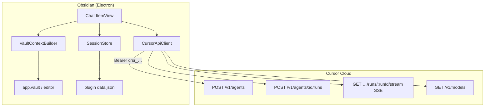
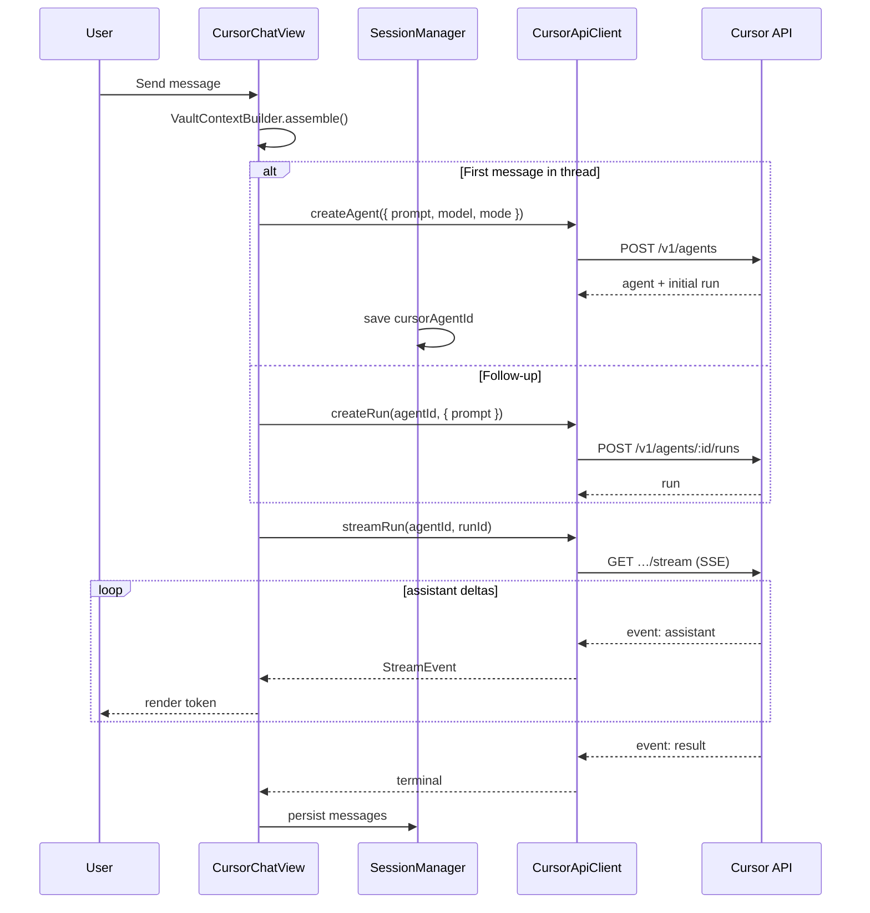

# Design — obsidian-cursor-plugin

## 1. Problem statement

Obsidian users want Cursor-grade AI assistance **inside their note-taking workflow** without leaving the vault. Cursor already exposes programmatic access through the **Cloud Agents API** and **TypeScript SDK**, but neither is an Obsidian plugin today.

This plugin bridges that gap: a native Obsidian sidebar chat that talks to Cursor over HTTPS with an API key, streams replies in real time, and grounds answers in vault context.

## 2. Goals

| Goal | Description |
|------|-------------|
| **In-vault chat** | Persistent sidebar `ItemView` with multi-turn conversations |
| **Cursor-native models** | Use Cursor-hosted models via API (not BYOK OpenAI keys) |
| **Streaming UX** | Token-by-token assistant output, tool-call visibility, cancel support |
| **Vault awareness** | Active file, selection, `@note` mentions, optional folder scope |
| **Secure credentials** | API key stored locally; never logged or synced by the plugin |
| **Resumable sessions** | Conversations survive Obsidian restarts |

## 3. Non-goals (v1)

- Mirroring the full Cursor IDE UI (composer tabs, inline diffs, Tab completion)
- Running `@cursor/sdk` **inside** the Obsidian renderer (Node 22 + native binaries; wrong runtime)
- Direct filesystem access from Cursor into the Obsidian vault (no mount API)
- Mobile-first parity (SSE streaming on mobile Obsidian is constrained; desktop first)
- Replacing Obsidian Sync or git-based vault sync

## 4. Architectural overview



### 4.1 Runtime choice: REST API, not SDK

| Option | Verdict |
|--------|---------|
| `@cursor/sdk` in plugin | **Rejected** — requires Node ≥ 22, spawns local agent loop, ships platform binaries; Obsidian plugins run in the renderer sandbox |
| Cloud Agents REST + SSE | **Selected** — `fetch` / `requestUrl` + `eventsource-parser`; works in Electron desktop |

A future **optional local bridge** (small Node sidecar or Cursor CLI wrapper) could unlock repo-local agents; it is out of scope for v1. See [§ 10 Future extensions](#10-future-extensions).

### 4.2 Agent model mapping

Cursor v1 API separates **durable agents** from **per-prompt runs**:

| Cursor concept | Plugin mapping |
|----------------|----------------|
| `Agent` (`bc-…`) | One Obsidian **chat thread** |
| `Run` (`run-…`) | One **user message → assistant reply** cycle |
| `prompt.text` | User message + assembled vault context |
| SSE `assistant` events | Streaming tokens in the UI |
| `GET …/runs/:id` | Fallback when stream expires (`410`) |

**No-repo agents** (omit `repos` and `env` on create) are the default for vault Q&A. Optional **repo-linked mode** attaches a GitHub repo when the vault is git-backed and the user wants code-agent behaviour.

### 4.3 Conversation modes

| Mode | Cursor `mode` | Use in Obsidian |
|------|---------------|-----------------|
| **Ask** | `plan` | Explore ideas, summarize notes, no file edits expected |
| **Agent** | `agent` | Multi-step reasoning; may suggest note edits (applied manually in v1) |

Mode is set on agent create and can be overridden per follow-up run.

## 5. Component design

### 5.1 `CursorChatPlugin` (main.ts)

Responsibilities:

- Register `CURSOR_CHAT_VIEW` `ItemView`
- Load / save settings and session index
- Register commands: *Open Cursor Chat*, *New chat*, *Send selection to chat*
- Ribbon icon
- Wire `CursorApiClient` with settings

### 5.2 `CursorChatView` (views/CursorChatView.ts)

Extends `ItemView`. Hosts the chat DOM (vanilla TypeScript for v1 — no React unless UI complexity forces it).

Sub-regions:

| Region | Responsibility |
|--------|----------------|
| Header | Thread title, model picker, mode toggle, new-chat |
| MessageList | Scrollable history with markdown rendering |
| Composer | Textarea, send/stop, context chips |
| StatusBar | Connection state, token usage, agent link |

### 5.3 `CursorApiClient` (api/CursorApiClient.ts)

Thin typed wrapper over Cloud Agents API:

```typescript
interface CursorApiClient {
  validateKey(): Promise<MeResponse>;
  listModels(): Promise<Model[]>;
  createAgent(opts: CreateAgentRequest): Promise<{ agent: Agent; run: Run }>;
  createRun(agentId: string, opts: CreateRunRequest): Promise<Run>;
  streamRun(agentId: string, runId: string, opts?: StreamOptions): AsyncGenerator<StreamEvent>;
  getRun(agentId: string, runId: string): Promise<RunDetail>;
  cancelRun(agentId: string, runId: string): Promise<void>;
  listAgents(cursor?: string): Promise<Paginated<AgentSummary>>;
}
```

Base URL: `https://api.cursor.com` (configurable constant only if Cursor documents staging).

Auth header: `Authorization: Bearer ${apiKey}`.

### 5.4 `SseReader` (api/SseReader.ts)

- Parses `text/event-stream` with `eventsource-parser`
- Supports `Last-Event-ID` resume per API spec
- Maps simplified events (`assistant`, `thinking`, `tool_call`, `result`, `error`, `done`) to internal `StreamEvent` union
- Desktop: prefer `fetch` + `ReadableStream` when CORS allows; fallback `requestUrl` for non-streaming poll via `GET /runs/:id`

### 5.5 `VaultContextBuilder` (context/VaultContextBuilder.ts)

Builds the **system prefix** appended to each user message (or sent once as initial context):

```
## Vault context
- Active note: [[Projects/Plan.md]] (modified 2026-07-14)
- Selection: "…"
- Attached notes: [[Meeting Notes]], [[Specs]]

---
<note body or excerpt>
```

Rules:

| Setting | Behaviour |
|---------|-----------|
| `includeActiveNote` | Full body or truncated to `maxContextChars` |
| `includeSelection` | Current editor selection when non-empty |
| `@mentions` in composer | Resolve `[[wikilink]]` or path to `TFile`, append contents |
| `respectFrontmatter` | Optionally strip YAML frontmatter from injected bodies |

Uses `app.workspace.getActiveViewOfType(MarkdownView)` and `editor.getSelection()` (source mode only for selection; preview mode shows a hint).

### 5.6 `ChatSessionManager` (session/ChatSessionManager.ts)

Persists:

```typescript
interface ChatSession {
  id: string;                    // local UUID
  title: string;
  cursorAgentId: string;         // bc-…
  modelId: string;
  mode: "agent" | "plan";
  createdAt: string;
  updatedAt: string;
  messages: StoredMessage[];     // local copy for offline display
  latestRunId?: string;
}

interface StoredMessage {
  id: string;
  role: "user" | "assistant" | "system" | "tool";
  content: string;
  runId?: string;
  createdAt: string;
  toolCalls?: ToolCallSummary[];
}
```

Storage: `this.loadData()` / `this.saveData()` with optional cap on retained sessions (`maxSessions`).

### 5.7 `CursorSettingsTab` (settings/CursorSettingsTab.ts)

| Setting | Type | Default |
|---------|------|---------|
| `apiKey` | password input | `""` |
| `defaultModelId` | dropdown from `/v1/models` | server default |
| `defaultMode` | `plan` \| `agent` | `plan` |
| `includeActiveNote` | boolean | `true` |
| `maxContextChars` | number | `32000` |
| `showThinking` | boolean | `false` |
| `openChatOnStartup` | boolean | `false` |
| `repoUrl` | string (optional) | `""` |
| `repoStartingRef` | string | `main` |

**Test connection** button calls `GET /v1/me`.

## 6. Request lifecycle



### 6.1 Concurrency rules

- Only **one active run per agent** — API returns `409 agent_busy`
- UI disables send while `status ∈ {CREATING, RUNNING}` or shows queue (v2)
- **Cancel** calls `POST …/runs/:runId/cancel` and aborts the local stream reader

### 6.2 Stream recovery

1. On disconnect, reconnect with `Last-Event-ID`
2. On `410 stream_expired`, poll `GET …/runs/:runId` until terminal
3. Surface `result` text from terminal run if stream missed deltas

## 7. Security & privacy

| Topic | Approach |
|-------|----------|
| API key storage | Obsidian plugin `data.json` (encrypted at rest only if user enables Obsidian OS keychain — document limitation) |
| Key in logs | Never log key; redact in error reports |
| Vault content | Sent to Cursor as prompt text — user must accept Cursor [Privacy Mode](https://cursor.com/privacy) / team policies |
| Network | HTTPS only; pin base URL constant |
| Service accounts | Supported for team automation; same Bearer auth |

Recommend a **first-run consent modal** explaining that note content is transmitted to Cursor's cloud.

## 8. Error handling

| HTTP | Meaning | UI action |
|------|---------|-----------|
| `401` | Invalid key | Settings prompt |
| `403` | Plan / scope | Upgrade message |
| `409 agent_busy` | Run in flight | Disable send / offer cancel |
| `409 run_not_cancellable` | Already terminal | Refresh run state |
| `410 stream_expired` | SSE window closed | Poll `GET run` |
| `429` | Rate limited | Backoff + retry hint |
| Network | Offline | Retry button; keep composer text |

## 9. Phased delivery

### Phase 0 — Scaffold (this repo)

- [x] Design docs
- [ ] `manifest.json`, esbuild, sample plugin layout
- [ ] Empty `ItemView` + settings tab

### Phase 1 — MVP chat

- API key settings + `/v1/me` validation
- Create no-repo agent, stream first reply
- Single session, markdown render, cancel

### Phase 2 — Multi-session UX

- Session list, titles auto-derived from first prompt
- Model picker (`/v1/models`)
- Vault context: active note + selection

### Phase 3 — Power features

- `@note` mentions, tool-call cards in UI
- Optional GitHub `repos` on agent create
- Export transcript to markdown note
- Usage display (`/v1/agents/:id/usage`)

### Phase 4 — Polish

- Theme-aware CSS variables
- Command palette integrations
- Stream resume + robust mobile story (if Obsidian adds streamable `requestUrl`)

## 10. Future extensions

| Extension | Description |
|-----------|-------------|
| **Local bridge** | Optional Node process running `@cursor/sdk` against vault path on disk |
| **MCP: Obsidian** | Expose vault search/read as MCP server referenced in `mcpServers` on agent create |
| **Apply edits** | Parse assistant suggestions into `app.vault.modify` patches with user approval |
| **Webhooks** | When Cursor ships v1 webhooks, sync run completion while Obsidian is closed |

## 11. Dependencies (planned)

| Package | Purpose |
|---------|---------|
| `obsidian` | Plugin API types |
| `esbuild` | Bundle |
| `typescript` | Types |
| `eventsource-parser` | SSE framing |
| `dompurify` | Sanitize rendered HTML (if not using Obsidian's `MarkdownRenderer` only) |

No `@cursor/sdk` in the plugin bundle.

## 12. Open questions

1. **CORS on desktop** — Confirm `fetch('https://api.cursor.com/…')` works from Obsidian Electron without `requestUrl`; if not, use `requestUrl` for REST and a chunked-read workaround for SSE.
2. **Default model** — Omit `model` on create to use Cursor account default, or always require explicit pick?
3. **Agent cleanup** — Cursor agent lifetime / max agents per user; need archival policy for old threads.
4. **Billing UX** — Show per-run token usage inline or link to Cursor dashboard only?
