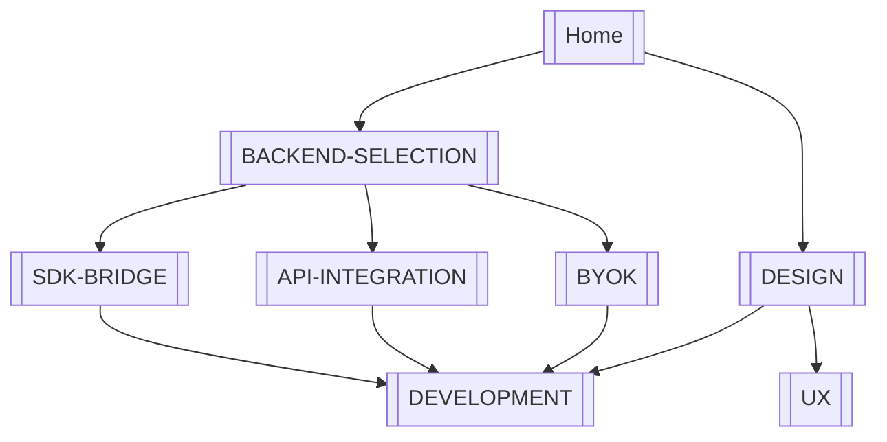

# obsidian-cursor-plugin — Documentation

> Map of content for the Obsidian + Cursor chat plugin design.  
> **Start here** if you opened this vault in Obsidian.

## Quick navigation

| I want to… | Open |
|------------|------|
| Pick a backend (BYOK vs Cursor vs SDK) | [[BACKEND-SELECTION]] |
| Use my own OpenAI / Ollama key | [[BYOK]] |
| Use a Cursor API key (`crsr_…`) | [[API-INTEGRATION]] |
| Run the Cursor SDK on vault files | [[SDK-BRIDGE]] |
| Understand the full architecture | [[DESIGN]] |
| Build the plugin | [[DEVELOPMENT]] |
| Design the chat UI | [[UX]] |
| Track PR implementation plan | [[IMPLEMENTATION-ROADMAP]] |

## Document map

## All notes

| Note | Role | Tags |
|------|------|------|
| [[BACKEND-SELECTION]] | Decision matrix — **read first** | `#backend` |
| [[BYOK]] | Provider-direct chat (`openai-compatible`) | `#backend` `#byok` |
| [[API-INTEGRATION]] | Cursor Cloud Agents REST (`cursor-rest`) | `#backend` `#cursor-api` |
| [[SDK-BRIDGE]] | Local SDK sidecar (`cursor-sdk-local`) | `#backend` `#sdk` |
| [[DESIGN]] | Architecture, components, phases | `#architecture` |
| [[DEVELOPMENT]] | Toolchain, layout, checklist | `#dev` |
| [[UX]] | Sidebar chat UI spec | `#ux` |
| [[IMPLEMENTATION-ROADMAP]] | Multi-PR build plan | `#dev` `#roadmap` |

## Three backends at a glance

| Backend | Credential | Doc |
|---------|------------|-----|
| `openai-compatible` | Provider BYOK (`sk-…`) | [[BYOK]] |
| `cursor-rest` | Cursor API key (`crsr_…`) | [[API-INTEGRATION]] |
| `cursor-sdk-local` | `crsr_…` on bridge host | [[SDK-BRIDGE]] |

Overview and rationale: [[BACKEND-SELECTION]] · Full system design: [[DESIGN]]

## Status

- **Phase:** 0 — design only (see [[DESIGN#9. Phased delivery]])
- **Implementation:** not started — checklist in [[DEVELOPMENT]]

## Using these notes in Obsidian

1. **Open as vault** — clone this repo and open the folder (or symlink `docs/` into an existing vault).
2. **Start at** [[Home]] — pin it or set as default note.
3. **Graph view** — filter tag `#obsidian-cursor-plugin` to see all design notes.
4. **Wikilinks** — `[[BYOK]]`, `[[DESIGN#5.3 BackendRouter]]`, etc. work between notes in `docs/`.
5. **Aliases** — e.g. `[[Bring Your Own Key]]` resolves to [[BYOK]].

Optional: enable **Mermaid** in Settings → Core plugins → if diagrams do not render.

## External links

- [Cursor Cloud Agents API](https://cursor.com/docs/cloud-agent/api/endpoints)
- [Cursor TypeScript SDK](https://cursor.com/docs/sdk/typescript)
- [Cursor Python SDK](https://cursor.com/docs/sdk/python)
- [Obsidian Plugin Developer Docs](https://docs.obsidian.md/Plugins/Getting+started/Build+a+plugin)
- [GitHub — obsidian-cursor-plugin](https://github.com/guilyx/obsidian-cursor-plugin)

---

## See also

- [[DESIGN]] — master architecture document
- [[BACKEND-SELECTION]] — which backend to implement first
